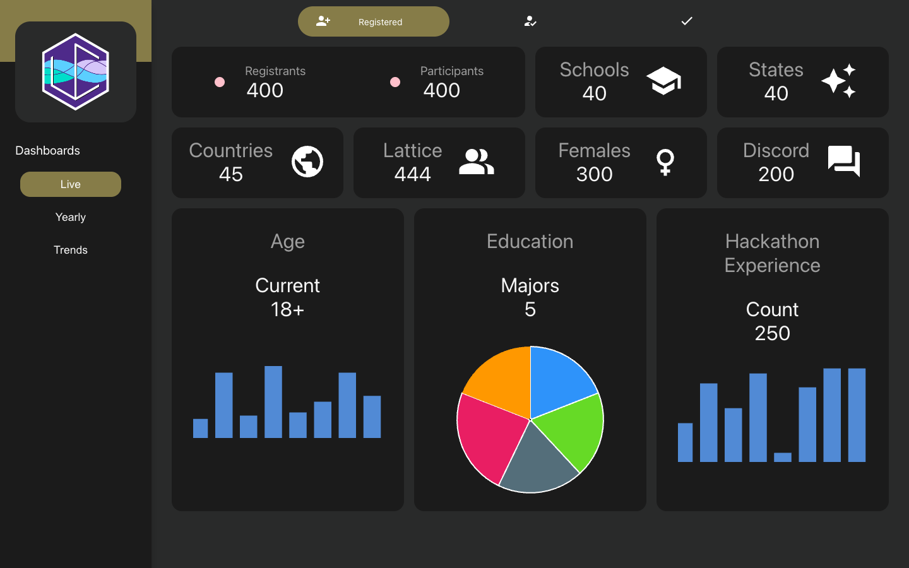
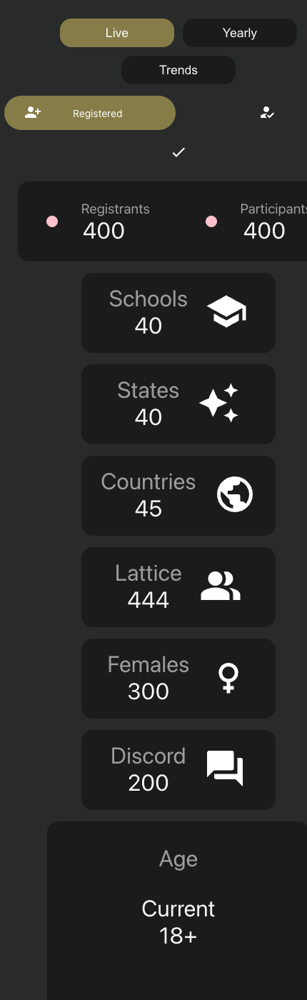

# RevolutionUC Dashboard

[](https://reactjs.org/)
[](https://mui.com/)
[](https://apexcharts.com/)
[](https://styled-components.com/)


A statistics dashboard built for **RevolutionUC**, the University of Cincinnati's
student hackathon. It turns registration and participation data into clean,
themeable charts the organizing team can use for data-driven decisions — live
event numbers, year-over-year history, and longer-term trends.



## What's inside

Three views, switched from the sidebar:

| View | What it shows |
|------|---------------|
| **Live** | Real-time event figures (registrants, schools, states, countries, etc.) plus age, education, and experience charts. Toggle between *Registered*, *Confirmed*, and *Checked In* cohorts. |
| **Yearly** | A per-event snapshot for each RevolutionUC, browsable through a logo carousel spanning 2014–2021. |
| **Trends** | Longer-term breakdowns — participation over time, demographics, and education — across the program's history. |

It's built from a small set of reusable, themed building blocks: figure cards
(`IconFigureCard`, `BadgeFigureCard`), chart cards (`BarChartCard`,
`PieChartCard`, `LineChartCard`), and a carousel — each driven by a theme object
in `src/components/themes/` so colors, sizes, and spacing stay consistent.

## Responsive layout

The dashboards reflow from a fixed-sidebar desktop layout to a stacked,
full-width mobile layout. A single `--sidebar-width` CSS variable drives every
page offset and collapses to zero on small screens, where the sidebar hides and
navigation moves to a top row.

<p>
  
</p>

## Running it

```bash
npm install
npm start          # opens http://localhost:3000
```

Build a production bundle with `npm run build`.

> Built with Create React App (react-scripts 4). On very recent Node versions you
> may need `NODE_OPTIONS=--openssl-legacy-provider` when building.

## Data

All figures live in `src/assets/data/`, split by view (`live/`, `annual/`,
`trends/`) and keyed per event. The numbers here are representative sample data;
swapping in real exports is just a matter of editing those files.

## Notes

Originally built for RevolutionUC and revisited since: the code has been cleaned
up and reformatted, the layout made responsive, and a couple of latent issues
fixed (a missing `react-router-dom` / `apexcharts` dependency and a dead remote
logo URL) so it builds and runs from a clean checkout.
